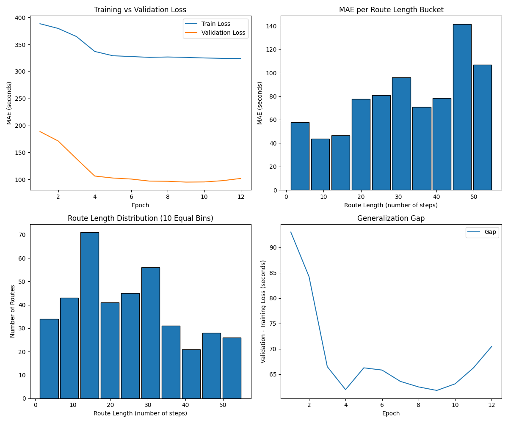

# LSTM Model Training Results

**Date:** 2025-12-01 14:51:48  
**Project:** Experimental - Route Time Estimation / Sequence Prediction  

---

## Dataset Overview
| Property | Value |
|----------|-------|
| **Number of Samples (Train/Val/Test)** | 1390 / 198 / 396 |
| **Route Length (Smallest/Largest)** | 1 / 55 |
| **Number of Input Features** | 32 |
| **Output** | 1 (Route Time in Seconds) |

---

## Model Architecture
| Component | Configuration |
|-----------|---------------|
| **Model Type** | LSTMModel |
| **Input Features** | 32 |
| **Hidden Size** | 16 |
| **Dropout** | 0.2 |
| **Feedforward Layers** | Linear(16->8) → ReLU → Dropout(0.2) → Linear(8->1) |
| **Total Parameters** | 3345 |

---

## Training Configuration
| Property | Value |
|----------|-------|
| **Total Epochs** | 12 |
| **Early Stopping** | Yes |
| **Batch Size (Train / Val / Test)** | 32 / 500 / 128 |
| **Optimizer** | Adam |
| **Learning Rate** | 0.001 |
| **Loss Function** | SmoothL1Loss |

---

## Performance Metrics
| Metric | Train | Validation | Test |
|--------|-------|------------|------|
| **MAE (Mean Absolute Error)** | 324.11 s | 21728.50 s | 75.41 s |

---

## Training Dynamics
- **Loss Progression:** see plot below (train vs. validation loss)

---
