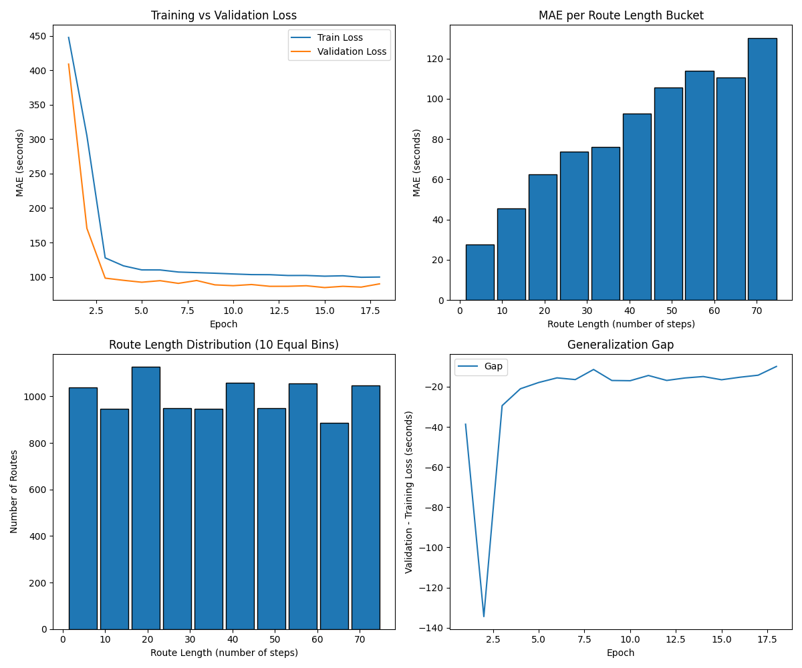

# LSTM Model Training Results

    **Date:** 2025-12-04 20:23:58  
    **Project:** padding50000 - Route Time Estimation / Sequence Prediction  

    ---

    ## Dataset Overview
    | Property | Value |
    |----------|-------|
    | **Number of Samples (Train/Val/Test)** | 35000 / 5000 / 10000 |
    | **Route Length (Smallest/Largest)** | 1 / 75 |
    | **Number of Input Features** | 34 |
    | **Output** | 1 (Route Time in Seconds) |

    ---

    ## Model Architecture
    | Component | Configuration |
    |-----------|---------------|
    | **Model Type** | LSTMModel |
    | **Input Features** | 34 |
    | **Hidden Size** | 128 |
    | **Dropout** | 0.1 |
    | **Feedforward Layers** | Linear(128->64) → ReLU → Dropout(0.1) → Linear(64->32) → ReLU → Dropout(0.1) → Linear(32->16) → ReLU → Dropout(0.1) → Linear(16->1) |
    | **Total Parameters** | 94849 |

    ---

    ## Training Configuration
    | Property | Value |
    |----------|-------|
    | **Total Epochs** | 18 |
    | **Early Stopping** | Yes |
    | **Batch Size (Train / Val / Test)** | 512 / 2048 / 2048 |
    | **Optimizer** | Adam |
    | **Learning Rate** | 0.001 |
    | **Loss Function** | SmoothL1Loss |

    ---

    ## Performance Metrics
    | Metric | Train | Validation | Test |
    |--------|-------|------------|------|
    | **MAE (Mean Absolute Error)** | 99.93 s | 90.03 s | 83.56 s |

    ---

    ## Training Dynamics
    - **Loss Progression:** see plot below (train vs. validation loss)

    

    ---
    